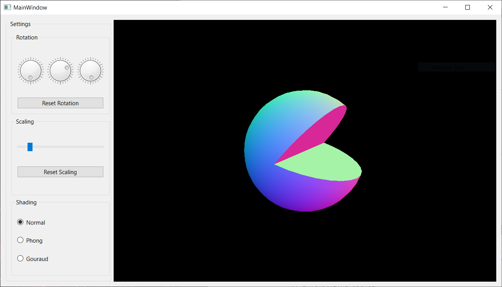
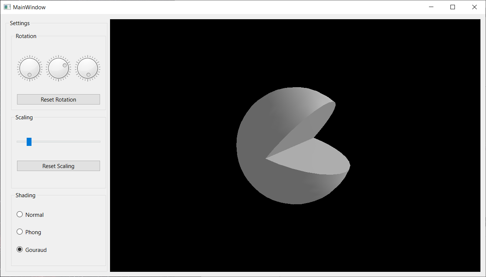
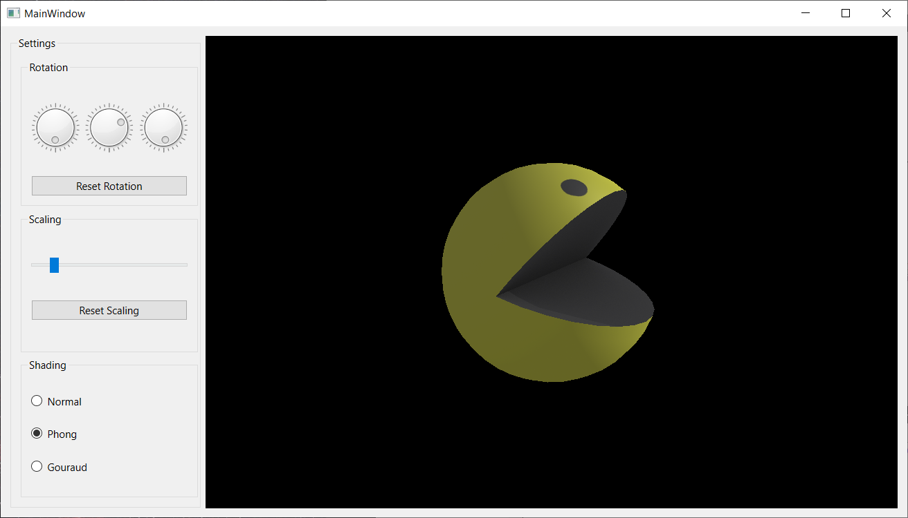

# Pacman
pacman object - simple implementation in OpenGL

## What you will see

With this code I tried to start on a simple pacman implementation - the classic game we all know and love!

For now by running the code we load and present a pacman model on a black background. Similar to OpenGL - 2 (aka the cat assignment) the user can use the 3 rotation dials to rotate Pacman and press the `Reset Rotation` button to bring it back to its initial rotation. Using the scaling slider below that, it is possible to help Pacman grow in size or shrink him and of course bring him back to his initial size using the `Reset Scaling` button. 

What is cool about all this? Right now you probably only see a sphere with normal shading and a cut-out piece.  Well you can also check out Pacman's Gouraud shading;  and of course the final result with Phong shading;  

## Running the code

To run the code simply clone the repository, go to folder `Pacman` > `src` and open the `CMakeLists.txt` file with your preferred IDE (I'm using QT for this). After you configure the code simply click on the build and run button and that's it! You can now play around with the Pacman object1

## Ideas for later

If you go check out the code you will see there's another object called blinky and his texture in `.mlt` format. That's one of the four pacman ghosts that could be implemented in a later stages.

Other ideas I had for this were moving the objects around with the keyboard arrows, implementing collision and adding the maze background, eventually leading to an implementation of a pacman-inspired game. The actual idea started as a way to play the game or at least move through the maze by having the camera (player) stay right behind pacman at all times and be in the maze, you could call this immersive Pacman.

## Credits

Models used

- Pacman: (https://sketchfab.com/3d-models/pacman-17800bd2ae224ee281e43efcbc498e43) by subtixx (https://sketchfab.com/subtixx) licensed under CC-BY-NC-4.0 (http://creativecommons.org/licenses/by-nc/4.0/)
- Blinky (ghost): (https://sketchfab.com/3d-models/blinky-from-pacman-47c0f24b17c943b790084545b0403047) by Yo Boy (https://sketchfab.com/jratanatharathorn) licensed under CC-BY-4.0 (https://creativecommons.org/licenses/by/4.0/)

Background Image

- Maze: taken from: (https://www.reddit.com/r/Pacman/comments/134jn7j/jr_pacman_but_now_in_widescreen_and_the_fruit/) edited by me
